# **School District Analysis Analysis**

## **Overview of Analysis**
The purpose of the analysis is to see how the summary metrics for the school district have changed since removing the invalid data for Thomas High School 9th Graders. The analysis will showcase the results that should be reported.

## **Results**
### **District Summary Differences**
**Original Summary**

**New Summary via Challenge**

    There is minimal shift in the average scores and the % passing for either subject or overall.

### **School Summary Differences**
**Original Summary**

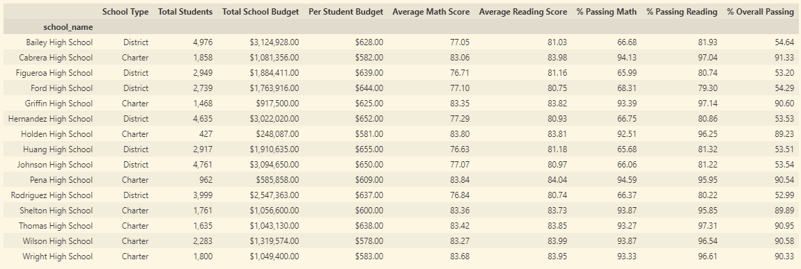

**New Summary via Challenge**
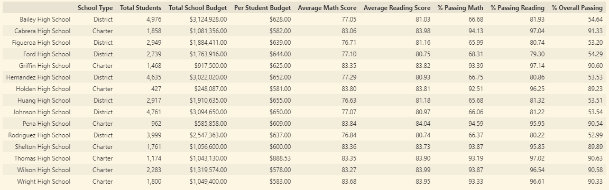

    The only shifts are for Thomas High School as would be expected. The % passing for the subjects and overall decreased for Thomas High School. The average math score decreased from 83.42 to 83.35 while the average reading score increased from 83.85 to 83.90. In both instances, these differences are not sizeable.

### **Replacing Ninth Grader Scores Impact on Thomas High School relative performance to other schools (Top and bottom 5)** 
**Original Top 5**

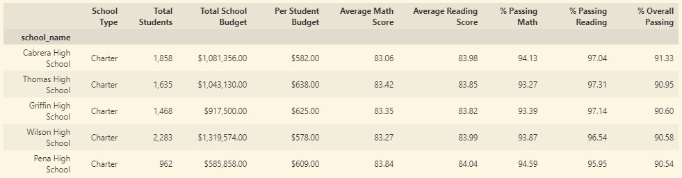

**New Top 5 Schools**

    Thomas High School's relative performance is stable. The school remained in the top 5 and outside of the bottom 5 when sorting by % Overall Passing.
### **Math and Reading Scores by Grade**

**Original Math Scores**

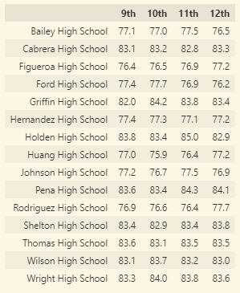

**New Math Scores**

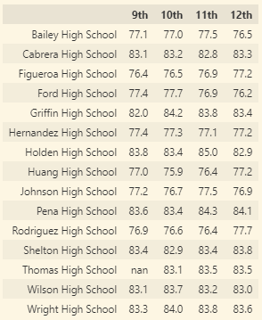

    New math scores tables reflects the removal of 9th grade scores from Thomas High School.
**Original Reading Scores**

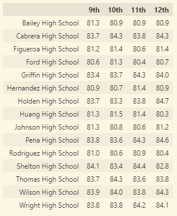

**New Reading Scores**

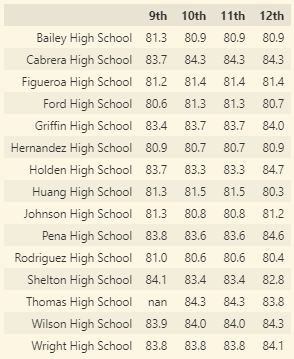

    New reading scores reflect the removal of 9th grade scores from Thomas High School.

    Besides the NaN values there is no other shift in this data views, as expected.
### **Scores by school spending** 
**Original Scores by Spending**

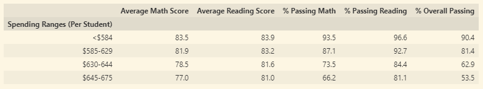

**New Scores by Spending**

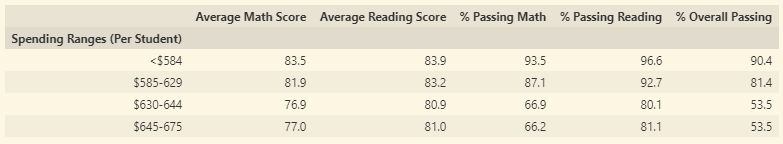

    The range of $630 to $644 was impacted by the Thomas High School edits. Percent passing rates decreased across each subject and overall as average scores dipped.

### Scores by school size

**Original Scores by Size**

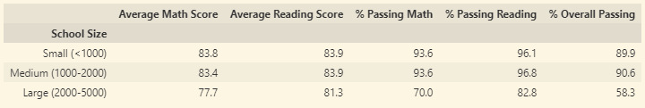

**New Scores by Size**

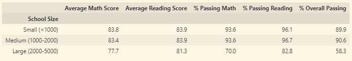

    The only adjustment is the portion of those passing reading for the medium-sized schools which is still a minor adjustment in comparison. There was no impact on percetn overall passing for medium-sized schools.

### **Scores by school Type**

**Original Scores by Type**

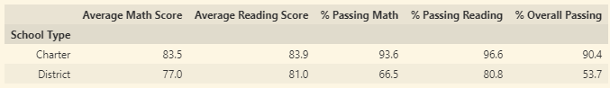

**New Scores by Type**

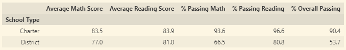

    The scores by school type did not shift at all when removing the Thomas High School ninth grade scores.

## **Summary**
The changes found after the analysis showcase the impact that these ninth grade scores in a single high school can have on a data set with 39,000+ students.

1) Overall math and reading passing rates decreased slightly when looked at the district summary view.
2) The school level summary also highlighted the shift when removing ninth grade scores. The portion of students passing math and reading both decreased.
3) There was a visible impact to the analysis of spending per student in the $630 to $644 per capita range.
4) There was a slight decrease in the portion of students from mid-size schools passing reading as a result of the anlaysis.   

